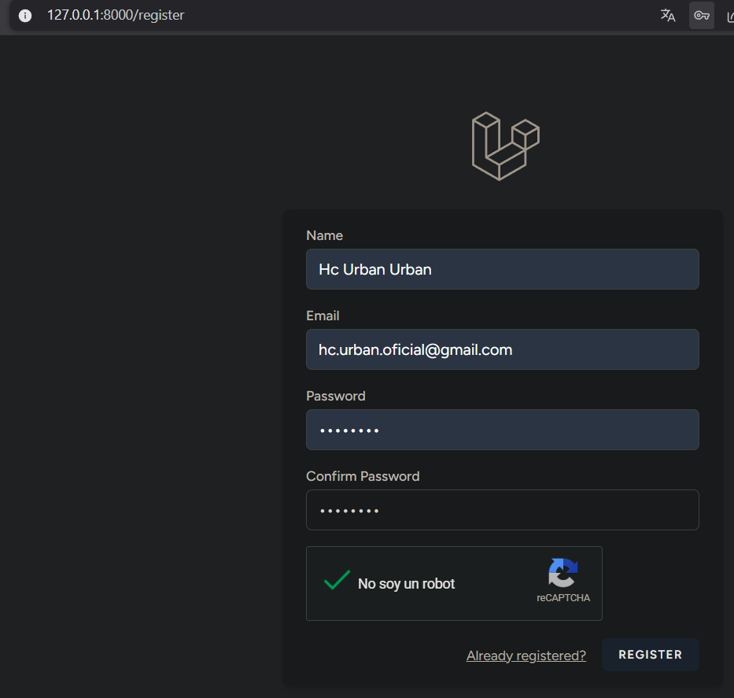
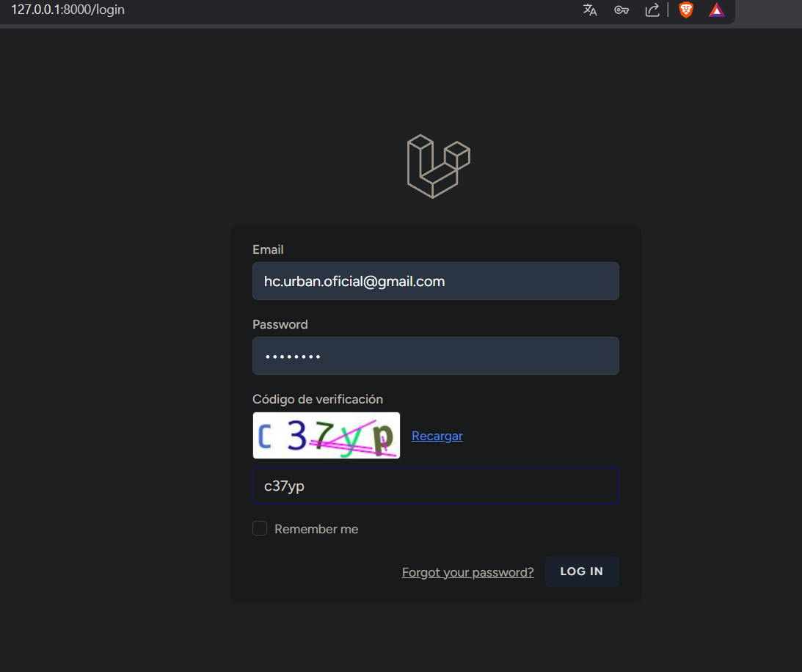
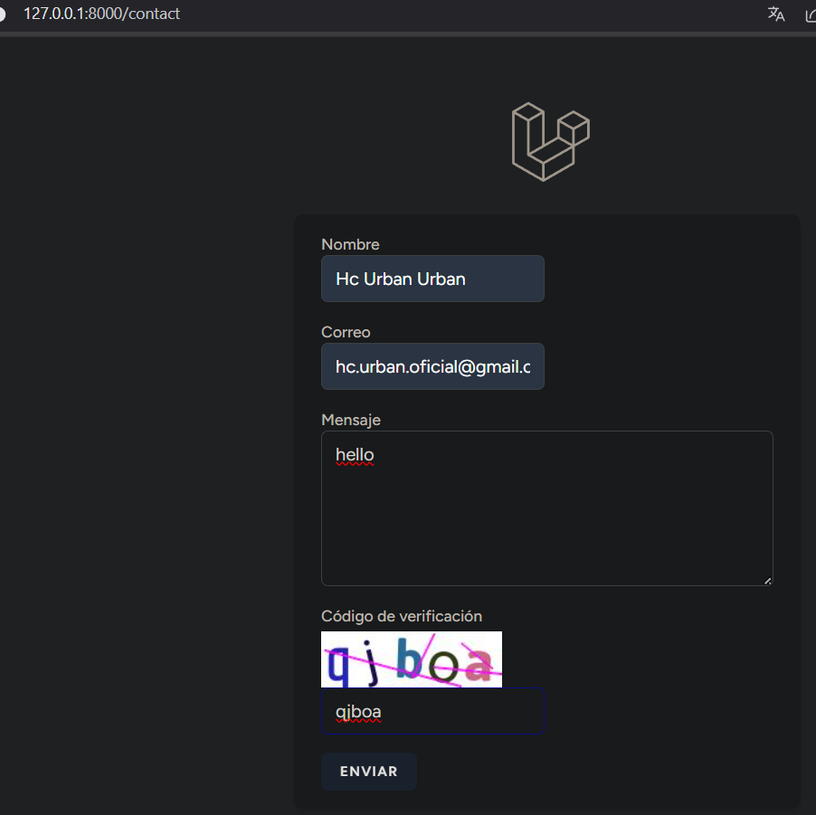

# INF781 — LaravelCaptcha

**Defensa contra bots y abuso automatizado con CAPTCHA en Laravel 13**

Proyecto de laboratorio de la materia **INF781 — Seguridad de Software** de la **Universidad Autónoma Tomás Frías (Potosí, Bolivia)**. Implementa tres mecanismos CAPTCHA distintos sobre formularios sensibles: reCAPTCHA v2, mews/captcha local y honeypot con rate limiting.

## Formularios protegidos

| Formulario | Mecanismo | Tipo |
|---|---|---|
| Registro | Google reCAPTCHA v2 | Checkbox "No soy un robot" + verificación server-side |
| Login | mews/captcha | Imagen distorsionada local (sin dependencia externa) |
| Contacto | Honeypot + Rate Limiting | Campo oculto CSS + 5 intentos/minuto por IP |

## Requisitos

- PHP 8.3+ con extensiones `gd`, `mbstring`, `pdo_pgsql`, `openssl`, `curl`
- Composer 2.7+
- Node.js 20+ con npm
- PostgreSQL 15+
- Cuenta de Google Cloud para claves reCAPTCHA

## Instalación

```bash
# 1. Clonar el repositorio
git clone https://github.com/BazilyCcherenkov/INF781--LaravelCaptcha.git
cd INF781--LaravelCaptcha

# 2. Instalar dependencias PHP
composer install

# 3. Instalar dependencias frontend
npm install && npm run build

# 4. Configurar variables de entorno
cp .env.example .env
php artisan key:generate

# 5. Crear base de datos y usuario PostgreSQL
sudo -u postgres psql -c "CREATE USER inf781_user WITH PASSWORD 'tu_password_seguro';"
sudo -u postgres psql -c "CREATE DATABASE inf781_captcha OWNER inf781_user;"

# 6. Editar .env con tus credenciales
#    DB_USERNAME=inf781_user
#    DB_PASSWORD=tu_password_seguro

# 7. Ejecutar migraciones
php artisan migrate

# 8. Iniciar servidor de desarrollo
php artisan serve
```

## Configurar reCAPTCHA v2

1. Ve a [https://www.google.com/recaptcha/admin](https://www.google.com/recaptcha/admin)
2. Crea un sitio nuevo → reCAPTCHA v2 → "No soy un robot" (Casilla)
3. Agrega los dominios `localhost` y `127.0.0.1`
4. Copia las claves en tu `.env`:

```bash
RECAPTCHA_SITE_KEY=6Lc...tu_site_key
RECAPTCHA_SECRET_KEY=6Lc...tu_secret_key
```

> ⚠ La Secret Key nunca debe aparecer en código frontend ni en commits.

## Ejecutar tests

```bash
php artisan test

# Tests específicos de CAPTCHA:
php artisan test --filter=CaptchaProtectionTest
```

Los tests validan:

- Rechazo de registro sin token reCAPTCHA
- Rechazo de login sin código CAPTCHA
- Rechazo silencioso de bots en formulario de contacto (honeypot)

## Capturas

### Formulario de registro — reCAPTCHA v2


### Formulario de login — mews/captcha


### Formulario de contacto — Honeypot + Rate Limiting


## Análisis crítico y discusión

### 22. Amenazas específicas que mitiga cada formulario y amenaza residual

**Registro (reCAPTCHA v2):** Este formulario es el punto de entrada al sistema y, por tanto, el blanco principal de ataques de registro masivo o Sybil attacks, donde un atacante crea cientos o miles de cuentas falsas de forma automatizada para inflar métricas, enviar spam, o realizar ataques de ingeniería social. También mitiga la enumeración de correos electrónicos: al requerir interacción humana, un atacante no puede probar direcciones de correo de forma masiva para determinar cuáles están registradas. Adicionalmente, dificulta el scraping de páginas internas que requieren autenticación, ya que crear una cuenta viable demanda intervención manual.

**Login (mews/captcha):** El formulario de inicio de sesión es el frente de batalla contra ataques de fuerza bruta y credential stuffing. La fuerza bruta consiste en probar combinaciones de usuario/contraseña de forma masiva hasta encontrar una válida; el credential stuffing reutiliza credenciales filtradas de otras plataformas. Al exigir que el usuario resuelva un CAPTCHA visual en cada intento, el costo computacional por intento se eleva dramáticamente: un script que podía probar 1000 contraseñas por segundo queda reducido a intentos manuales. Combinado con el rate limiting nativo de Laravel (5 intentos por minuto), la ventana de ataque se vuelve inviable.

**Contacto (honeypot + rate limiting):** El formulario de contacto público es el blanco predilecto del spam automatizado. El honeypot filtra bots rudimentarios que rellenan todos los campos del formulario, incluidos los invisibles. El rate limiting (5 intentos por minuto por IP) complementa esta defensa al impedir que un atacante que haya identificado y evadido el honeypot pueda enviar grandes volúmenes de mensajes. Ambos mecanismos operan sin fricción para el usuario legítimo, ya que el honeypot es invisible y el rate limiting solo afecta después de múltiples envíos.

**Amenaza residual:** Ninguna de estas defensas es absoluta. Los ataques distribuidos (botnets) pueden sortear el rate limit rotando IPs entre miles de nodos comprometidos. Las granjas humanas (click farms) ofrecen resolución manual de CAPTCHAs por tan solo 0.50 USD por cada 1000 resoluciones, lo que hace económicamente viable eludir incluso reCAPTCHA v2 para atacantes con recursos. El CAPTCHA de texto distorsionado de mews/captcha es vulnerable a modelos de OCR basados en deep learning (Tesseract, CRNN). La defensa real está en la defensa en profundidad: combinar CAPTCHA con rate limiting, MFA, detección de comportamiento anómalo y monitorización de patrones de tráfico.

### 23. Comparativa: reCAPTCHA v2 vs mews/captcha

| Dimensión | reCAPTCHA v2 (Google) | mews/captcha |
|---|---|---|
| **Seguridad** | Alta — análisis comportamental, reputación de IP, detección de navegador headless | Media-baja — vulnerable a OCR moderno y parsers de visión artificial |
| **Accesibilidad** | Incluye alternativa de audio para personas con discapacidad visual; compatible con WCAG 2.1 | Limitada — solo imagen visual, sin alternativa auditiva; incumple estándares básicos de accesibilidad |
| **Privacidad del usuario** | Problemática — Google recopila cookies, historial de navegación, patrones de comportamiento y huella digital del dispositivo | Excelente — cero rastreo externo, toda la información permanece en el servidor local |
| **Dependencia externa** | Total — requiere conexión a servidores de Google; si el servicio está caído o bloqueado (China, Crimea), el formulario se vuelve inutilizable | Nula — funciona completamente offline, sin dependencia de terceros ni latencia de red |
| **Experiencia de usuario** | Fluida — el usuario solo debe marcar una casilla y en la mayoría de los casos Google lo aprueba sin interacción adicional | Fricción alta — el usuario debe leer e interpretar texto distorsionado y tipearlo correctamente, con alta tasa de error en caracteres ambiguos |

**¿En qué escenario preferir cada uno?** reCAPTCHA v2 es la opción superior para aplicaciones web públicas orientadas al consumidor final, donde la experiencia de usuario es prioritaria y la exposición a bots es alta (tiendas online, redes sociales, servicios SaaS). mews/captcha es preferible en intranets corporativas, sistemas gubernamentales, proyectos con requisitos estrictos de privacidad (GDPR, HIPAA, soberanía de datos), aplicaciones offline o entornos donde los servidores de Google están bloqueados. También es una solución adecuada como segunda barrera detrás del rate limiting en formularios de bajo riesgo.

### 24. Evasión de CAPTCHA de imágenes y defensas complementarias

**Forma 1 — OCR y visión artificial avanzada:** Los CAPTCHA de texto distorsionado como los generados por mews/captcha son vulnerables a sistemas de OCR modernos. Herramientas como Tesseract OCR, redes neuronales convolucionales (CNN) y modelos CRNN (Convolutional Recurrent Neural Networks) pueden segmentar y reconocer caracteres incluso con ruido, líneas superpuestas y distorsión. Investigaciones académicas (Bursztein et al., 2014; Gao et al., 2022) reportan tasas de acierto superiores al 90% en CAPTCHAs comerciales de texto. La razón fundamental es que la misma distorsión que hace legible el texto para humanos sigue patrones predecibles que una red bien entrenada puede aprender.

**Forma 2 — Granjas humanas y servicios de resolución por API:** Servicios como 2Captcha, Anti-Captcha y DeathByCaptcha ofrecen APIs donde un atacante envía la imagen del CAPTCHA y recibe la solución en segundos. Detrás de estos servicios hay trabajadores humanos en países de bajo costo que resuelven CAPTCHAs manualmente. Con precios de 0.50 a 2.00 USD por 1000 resoluciones, el costo de eludir un CAPTCHA es despreciable incluso para atacantes con presupuestos modestos. Esto hace que ningún CAPTCHA basado únicamente en desafíos visuales sea seguro contra ataques con presupuesto.

**Defensas complementarias:**

- **Rate limiting**: Limitar el número de intentos por IP, usuario y sesión en ventanas de tiempo. Ya implementado en login (5 intentos/minuto) y contacto (5 intentos/minuto). Defiende contra granjas humanas al hacer que cada intento requiera una nueva resolución de CAPTCHA, elevando el costo económico.
- **Autenticación multifactor (MFA)**: Añadir un segundo factor (TOTP, SMS, llave de seguridad) después del login con credenciales. Incluso si un atacante obtiene la contraseña, no puede acceder sin el segundo factor.
- **Análisis de comportamiento**: Medir tiempo entre pulsaciones, velocidad de escritura, movimiento del ratón, patrón de navegación y uso del portapapeles. Los bots muestran patrones significativamente diferentes a los humanos (tiempos exactos, sin errores de tipeo, movimiento de ratón lineal).
- **Proof-of-Work (PoW)**: Soluciones como Cloudflare Turnstile y Friendly Captcha requieren que el navegador del cliente resuelva un problema computacional costoso antes de enviar el formulario. Esto hace que los ataques masivos sean computacionalmente prohibitivos sin añadir fricción al usuario.
- **Machine Learning**: Entrenar modelos de detección de bots basados en características de la solicitud HTTP (cabeceras, orden de parámetros, patrones de User-Agent) para complementar el CAPTCHA.

### 25. Privacidad y críticas GDPR a reCAPTCHA

Google reCAPTCHA introduce problemas significativos de privacidad que han generado controversia legal en la Unión Europea. Cuando un usuario interactúa con el widget de reCAPTCHA, Google recopila la siguiente información sin consentimiento explícito del usuario:

- Dirección IP completa y geolocalización aproximada
- Cookies de Google (NID, ANID, __Secure-*) que permiten rastrear al usuario a través de sitios web
- Huella digital del navegador (user-agent, plugins instalados, resolución de pantalla, zona horaria, fuentes del sistema)
- Patrones de interacción con el widget: velocidad y trayectoria del movimiento del ratón, tiempo de clic, secuencia de tecleo
- Historial de navegación del usuario cuando utiliza servicios de Google (el CAPTCHA se comunica con los servidores de Google incluso antes de que el usuario interactúe con él)

El problema central desde la perspectiva del GDPR (Reglamento General de Protección de Datos de la UE) es múltiple:

1. **Base legal cuestionable**: Google argumenta que reCAPTCHA es necesario para proteger sus servicios (interés legítimo, Art. 6(1)(f) GDPR). Sin embargo, la transmisión de datos a servidores en EE. UU. sin garantías adecuadas de protección ha sido considerada ilegal por el Tribunal de Justicia de la Unión Europea (TJUE) en el caso Schrems II (C-311/18).

2. **Minimización de datos violada**: El Art. 5(1)(c) GDPR exige que los datos recopilados sean adecuados, pertinentes y limitados a lo necesario. Enviar cookies y datos de navegación completos para determinar si un usuario es humano es desproporcionado cuando existen alternativas menos invasivas como mews/captcha.

3. **Falta de consentimiento explícito**: El Art. 7 GDPR requiere consentimiento libre, específico e informado. La mayoría de los sitios web implementan reCAPTCHA sin informar al usuario ni obtener su consentimiento para la transferencia de datos a Google.

4. **Transferencia internacional de datos**: Los datos del usuario son enviados a servidores en EE. UU. y otros países sin garantías de nivel de protección equivalente al de la UE, lo que viola los Capítulos V y Art. 44-49 GDPR.

Como resultado, varias autoridades de protección de datos (CNIL en Francia, DPC en Irlanda) han emitido directrices advirtiendo que el uso de reCAPTCHA sin consentimiento explícito puede ser ilegal. Alternativas que respetan la privacidad incluyen hCaptcha (que no rastrea usuarios entre sitios), Cloudflare Turnstile (PoW sin cookies) y, por supuesto, soluciones locales como mews/captcha que eliminan completamente cualquier transferencia de datos a terceros.

## Licencia

MIT License
